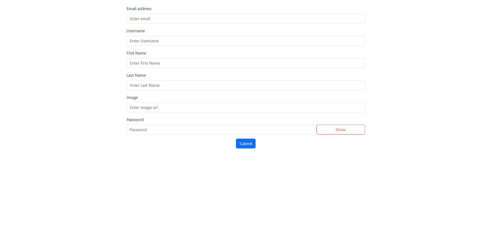

# Form Validation Project

<div align="center">
  
</div>

## About the Project

This project contains a simple web application for validating user input data in a registration form. The application performs basic form validation processes and notifies the user of any errors.

## Table of Contents

- [Conditions](#conditions)
- [Project Skeleton](#project-skeleton)
- [Screenshots](#screenshots)

## Project Link

You can find the live version of the project [here](https://form-validasyon.vercel.app/).

## Conditions

-All fields must be filled.
-Password must be at least 8 characters.
-Email must be valid, containing '@'.
-Image must be a valid URL.
-Username, Firstname, and Lastname must be at least 3 characters long, excluding spaces.
-If the user tries to click the button without passing validation, the button is disabled. If validation fails, the button constantly moves when hovered over. It stops moving when the cursor is moved away.
-When the form is submitted, the entered information is displayed in a card structure below.
-Clicking the "Show" button reveals the entered password. Clicking the "Hidden" button cancels the password visibility.

## Project Skeleton

```
Form Validation (folder)
|
|----readme.md         
SOLUTION
├── public
│     └── index.html
├── src
│    ├── assets
│    ├── components
│    │   ├── card
│    │   │   └── Cards.jsx
│    │   └── forms
│    │       ├── Forms.jsx
│    │       └── form.css
│    ├── App.js
│    ├── index.js
├── package.json
└── yarn.lock

```

## Screenshots

<div align="center">
  
  
  
</div>

## Compatibility

The project is compatible with both wide-screen computers and mobile devices.
